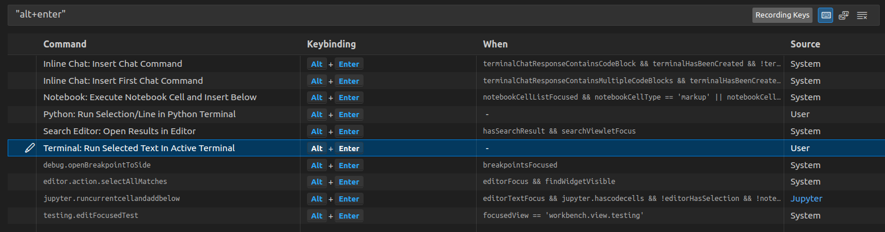
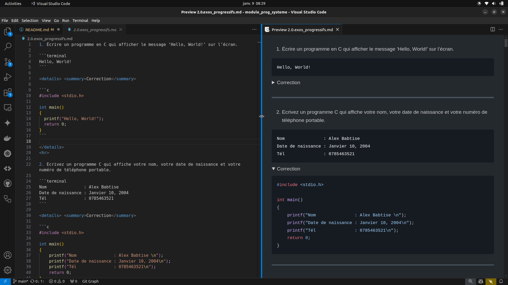
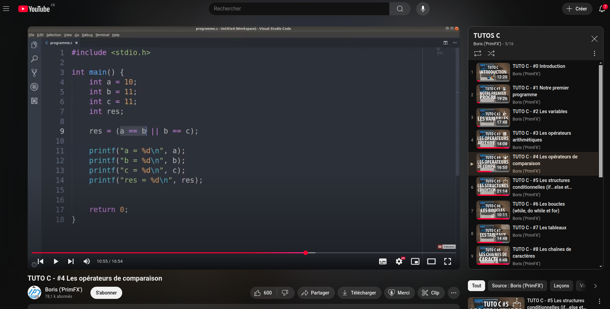
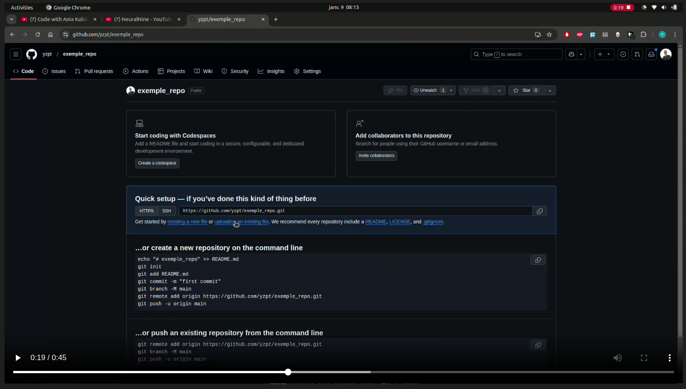
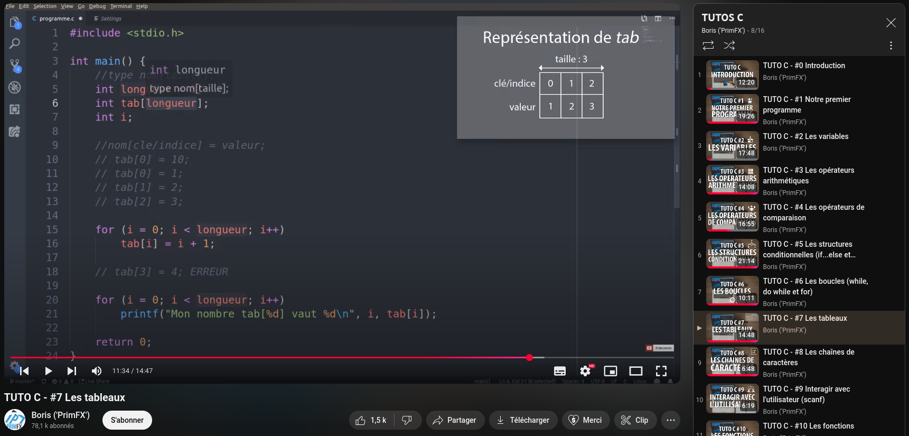
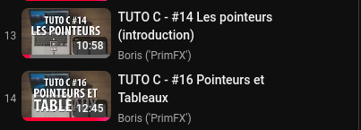
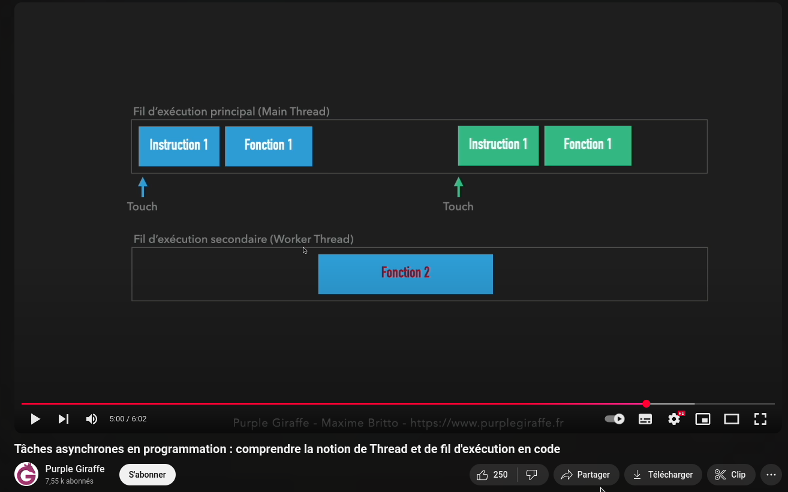
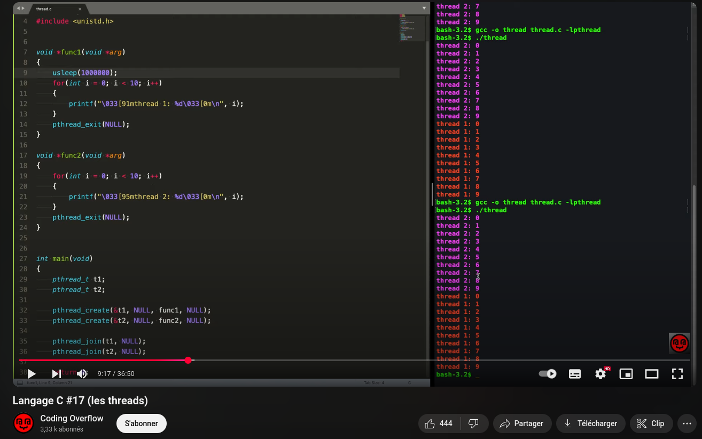

# B2-Cyber - Programmation système

### Programmation système (B2)
Niveau: Bachelor 2
Rythme: Tronc commun 

- Format de l’évaluation
50% contrôle continu (format apprécié: travaux pratiques)
50% partiel

- Objectifs pédagogiques: 
  * Maîtriser l’architecture matérielle des ordinateurs (processeur, mémoire, périphériques entrée/sortie) - rappelle B1 “Architecture des ordinateurs”
  * Programmer en C: syntaxe, structures de contrôle (boucles, conditions), types de données, fonctions, pointeurs, tableaux, structures, unions
  * Comprendre les mécanismes de gestion des processus et threads au niveau du système d’exploitation 

yohann.zapart@gmail.com

# Mercredi 8 janvier 2025

### 0.1. Ressources sélectionnées:
* Language C :
  - [Maude_Manouvrier_cours.pdf](pdf/Maude_Manouvrier_cours.pdf)
  - [Maude_Manouvrier_exercices.pdf](pdf/Maude_Manouvrier_exercices.pdf)
  - [Maude_Manouvrier_TP_C_linux.pdf](pdf/Maude_Manouvrier_TP_C_linux.pdf)
  - [cours-c-c++_thierry_vaira.pdf](pdf/cours-c-c++_thierry_vaira.pdf)
* Architecture des ordinateurs :
  - [Cours_ghalouci_architecture.pdf](pdf/Cours_ghalouci_architecture.pdf)

D'autres ressources disponibles dans le fichier [1.1.resources.md](1.1.ressources.md)

### 0.2. Raccoucis claviers utiles
Abusez des raccourcis claviers pour gagner en efficacité !
Sous VSCODE : Ctrl + K -> Ctrl + S pour ouvrir la liste des raccourcis claviers.
Votre meilleur ami : Run Selected Text In Active Terminal

### 0.3. CheatSheets:
- https://www.geeksforgeeks.org/c-cheatsheet/
- https://www.codewithharry.com/blogpost/c-cheatsheet/
- https://www.tutorialspoint.com/cprogramming/c_language_cheatsheet.htm

# 1.0. Installation et exécution sous VSCode
- Suivre les indications du fichier [1.0.installation.md](1.0.installation.md)

# 2.0 Exercices progressifs [2.0.exos_progressifs.md](2.0.exos_progressifs.md)
- (Ouvrir le visualisateur Markdwon avec le raccourci "Ctrl + Shift + V" dans VSCode afin de masquer les réponses.)
  

### Tutoriel sélectionné : "TUTOS C" de la chaine PrimFX
- https://www.youtube.com/watch?v=3Fr-BVdrAk0&list=PLEagTQfI6nPOWS4JPnxW5pRVgeyLuS5oC&ab_channel=Boris%28%27PrimFX%27%29

- Soyez proactifs dans votre apprentissages !
- **RECHERCHEZ** par vous-même les algorithmes, c'est très important, essence de l'apprentissage !
- En cas de blocage/difficultés, consultez dans l'ordre :
  - Moi (l'enseignant)
  - ChatGPT / Google
  - La correction

# Jeudi 9 janvier 2025

## Roadmap :

#### Créer un repo github pour le cours de programmation système !
- Afin que je puisse examiner vos travaux dans les bonnes pratiques. 
- Il est indispensable de maîtriser git et github pour votre carrière professionnelle. Il n'est jamais trop tard pour commencer.
- Capsule vidéo [(tuto_repo_github.mp4)](tuto_repo_github.mp4) pour vous aider à créer et uploader des fichiers depuis le site web de github.
  

## 2.1. Exercices sur les tableaux à maîtriser complètement : [2.1.exos_tableaux.md](2.1.exos_tableaux.md)

- Ressource vidéo sélectionnée : https://youtu.be/pAT3Nbp-utE?si=7D1dAXpuV5obQGWr

## 2.2. Exercices sur les pointeurs : [2.2.exos_pointeurs.md](2.2.exos_pointeurs.md)

- Vidéos :
  
  
- Les pointeurs, introduction : https://youtu.be/iVK2YIhi6lE?si=wPfHveKnt5JRco0a
- Pointeurs et tableaux : https://youtu.be/ipxT2_2T3qs?si=v9W7kY40JL-ZMUbx

## 3 Les Threads : [2.3.exos_threads.md](2.3.exos_threads.md)

- Tâches asynchrones en programmation : comprendre la notion de Thread et de fil d'exécution en code - Purple Giraffe
- https://www.youtube.com/watch?v=AoyT1UkyZnc&ab_channel=PurpleGiraffe
  

- Langage C #17 (les threads) - Coding Overflow
- https://www.youtube.com/watch?v=o_GbRujGCnM&t=901s&ab_channel=CodingOverflow
  

