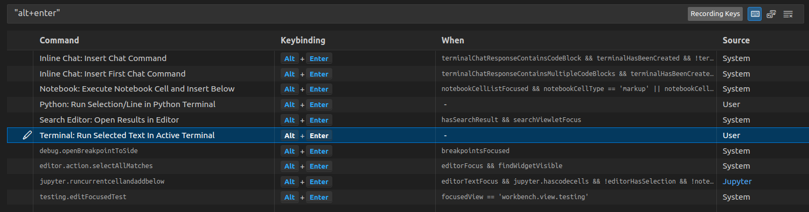
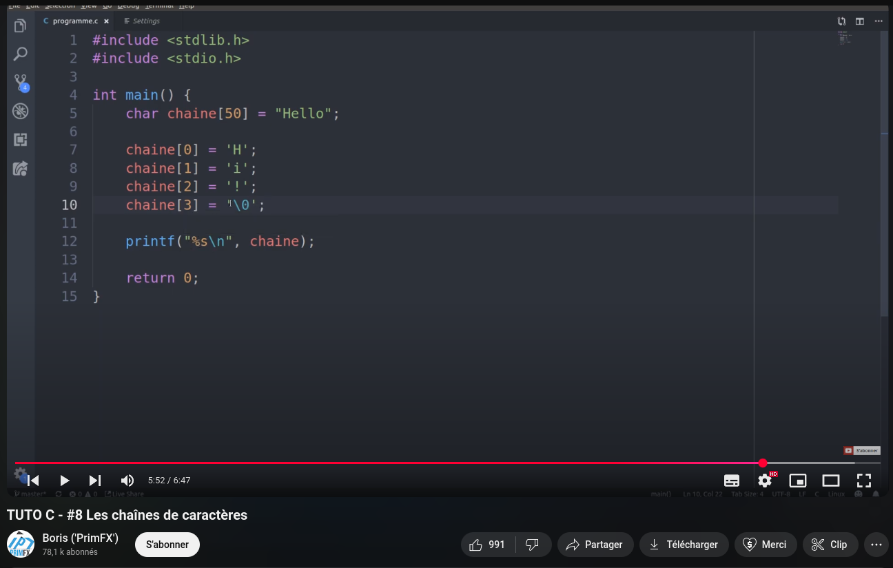
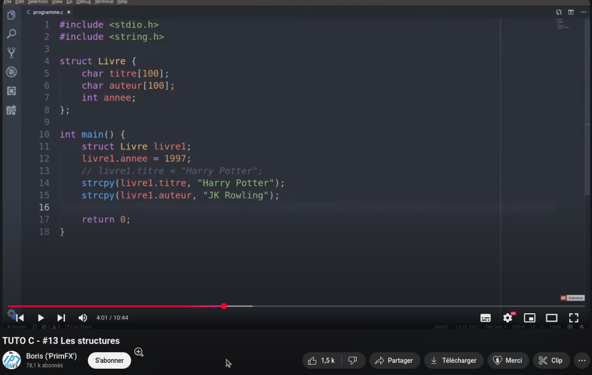

# B2-Cyber - Programmation système

### Programmation système (B2)
Niveau: Bachelor 2
Rythme: Tronc commun 

- Format de l’évaluation
50% contrôle continu (format apprécié: travaux pratiques)
50% partiel

- Objectifs pédagogiques: 
  * Maîtriser l’architecture matérielle des ordinateurs (processeur, mémoire, périphériques entrée/sortie) - rappelle B1 “Architecture des ordinateurs”
  * Programmer en C: syntaxe, structures de contrôle (boucles, conditions), types de données, fonctions, pointeurs, tableaux, structures, unions
  * Comprendre les mécanismes de gestion des processus et threads au niveau du système d’exploitation 


yohann.zapart@gmail.com

<hr>

# Mercredi 8 janvier 2025

### 0.1. Ressources sélectionnées:
* Language C :
  - [Maude_Manouvrier_cours.pdf](pdf/Maude_Manouvrier_cours.pdf)
  - [Maude_Manouvrier_exercices.pdf](pdf/Maude_Manouvrier_exercices.pdf)
  - [Maude_Manouvrier_TP_C_linux.pdf](pdf/Maude_Manouvrier_TP_C_linux.pdf)
  - [cours-c-c++_thierry_vaira.pdf](pdf/cours-c-c++_thierry_vaira.pdf)
* Architecture des ordinateurs :
  - [Cours_ghalouci_architecture.pdf](pdf/Cours_ghalouci_architecture.pdf)

D'autres ressources disponibles dans le fichier [1.1.resources.md](1.1.ressources.md)


### 0.2. Raccoucis claviers utiles
Abusez des raccourcis claviers pour gagner en efficacité !
Sous VSCODE : Ctrl + K -> Ctrl + S pour ouvrir la liste des raccourcis claviers.
Votre meilleur ami : Run Selected Text In Active Terminal


### 0.3. CheatSheets:
- https://www.geeksforgeeks.org/c-cheatsheet/
- https://www.codewithharry.com/blogpost/c-cheatsheet/
- https://www.tutorialspoint.com/cprogramming/c_language_cheatsheet.htm

<hr>

# 1.0. Installation et exécution sous VSCode
- Suivre les indications du fichier [1.0.installation.md](1.0.installation.md)

<hr>

# 2.0 Exercices progressifs<br> [2.0.exos_progressifs.md](2.0.exos_progressifs.md)

- (Ouvrir le visualisateur Markdwon avec le raccourci "Ctrl + Shift + V" dans VSCode afin de masquer les réponses.)
  

### Tutoriel sélectionné : "TUTOS C" de la chaine PrimFX
- https://www.youtube.com/watch?v=3Fr-BVdrAk0&list=PLEagTQfI6nPOWS4JPnxW5pRVgeyLuS5oC&ab_channel=Boris%28%27PrimFX%27%29


- Soyez proactifs dans votre apprentissages !
- **RECHERCHEZ** par vous-même les algorithmes, c'est très important, essence de l'apprentissage !
- En cas de blocage/difficultés, consultez dans l'ordre :
  - Moi (l'enseignant)
  - ChatGPT / Google
  - La correction

<hr>

# Jeudi 9 janvier 2025

## Roadmap :

#### Créer un repo github pour le cours de programmation système !
- Afin que je puisse examiner vos travaux dans les bonnes pratiques. 
- Il est indispensable de maîtriser git et github pour votre carrière professionnelle. Il n'est jamais trop tard pour commencer.
- Capsule vidéo [(tuto_repo_github.mp4)](tuto_repo_github.mp4) pour vous aider à créer et uploader des fichiers depuis le site web de github.
  

<hr>

## 2.1. Exercices sur les tableaux à maîtriser complètement<br>[2.1.exos_tableaux.md](2.1.exos_tableaux.md)

- Ressource vidéo sélectionnée : https://youtu.be/pAT3Nbp-utE?si=7D1dAXpuV5obQGWr


<hr>

## 2.2. Les pointeurs<br>[2.2.exos_pointeurs.md](2.2.exos_pointeurs.md)

- Vidéos :
  
  
- Les pointeurs, introduction : https://youtu.be/iVK2YIhi6lE?si=wPfHveKnt5JRco0a
- Pointeurs et tableaux : https://youtu.be/ipxT2_2T3qs?si=v9W7kY40JL-ZMUbx

<hr>

## 2.3 Les Threads <br>[2.3.exos_threads.md](2.3.exos_threads.md)

| Ressource | Aperçu |
|-----------|--------|
| Tâches asynchrones en programmation : comprendre la notion de Thread et de fil d'exécution en code - Purple Giraffe <br><br>https://www.youtube.com/watch?v=AoyT1UkyZnc&ab_channel=PurpleGiraffe |  |
| Langage C #17 (les threads) - Coding Overflow <br><br> https://www.youtube.com/watch?v=o_GbRujGCnM&t=901s&ab_channel=CodingOverflow |  |

<hr>

## 2.4 Chaines de caractères et structures: projet.

### 2.4.1. Ressources vidéos:

| Ressource | Aperçu |
|-----------|--------|
| Chaînes de caractères en C<br><br>https://youtu.be/LaJLzx9Qi_0?si=mcFBuC8EHccc3rQK |  |
| Structures <br><br>https://youtu.be/JsUSp4cf_2w?si=CLt0S0iVYIHoMt28 |  |

### 2.4.2. Projet incluant l'utilisation de structures et chaines de caractères:

Ce projet consiste à créer un programme qui permet de gérer un répertoire dans lequel seront enregistrés pour chaque personne les champs suivants:
- Nom
- Prénom
- Numéro de téléphone (sur 10 chiffres sans espace)
- Adresse mail

- Maximum de 50 personnes.
- Chaque champ sera défini sous la forme d’un tableau de 30 chaînes de caractères. Pour gérer les chaînes de caractères, nous utiliserons les fonctions de la bibliothèque `<string.h>`.

#### Guide 

1. Définir les variables à utiliser (nombre, nom, type); Préciser comment seront déclarées ces variables (locales ou globales).
2. Écrire une fonction qui permet d’ajouter une personne dans le répertoire.
3. Écrire une fonction qui permet d’afficher le contenu du répertoire.
4. Écrire une fonction qui permet de rechercher une personne dans le répertoire en spécifiant son numéro de téléphone.
   - Prévoir le cas où la personne recherchée n’est pas dans le répertoire.
   - Pour simplifier le problème, on suppose que chaque numéro de téléphone est unique.
5. Imaginer d’autres fonctions pour permettre la manipulation d’un tel répertoire.

<div style="text-align: center; color: pink; font-size: 1.2em;">
Libre à vous d'imaginer d'autres projets: facturation, gestion de compte bancaire, etc.
</div>

#### Base de code pour bien démarrer:

```c
#include <stdio.h>
#include <string.h>

#define MAX_PERSONNES 50
#define MAX_CHAINE 30

// Définition de la structure pour une personne
typedef struct {
    char nom[MAX_CHAINE];
    char prenom[MAX_CHAINE];
    char telephone[11]; // 10 chiffres + '\0'
    char email[MAX_CHAINE];
} Personne;

// Déclaration du répertoire et du nombre de personnes
Personne repertoire[MAX_PERSONNES];
int nbPersonnes = 0;


int main()
{
    int Action;

    while(1)
    {
        printf("Que voulez vous faire :\n");
        printf("* Ajouter une personne         (1)\n");
        printf("* Afficher le répertoire       (2)\n");
        printf("* Faire une recherche par nom  (3)\n");
        printf("* Retirer une personne par nom (4)\n");
        printf("* Terminer                     (5)\n");

        scanf("%d", &Action);
        if (Action == 1) Creer_Enregistrement();
        if (Action == 2) Affiche_Repertoire();
        if (Action == 3) Recherche();
        if (Action == 4) Retirer();
        if (Action == 5) break;

        printf("\n");
        printf("\n");
    }

    printf("terminé...");
    return 0;
}
```
